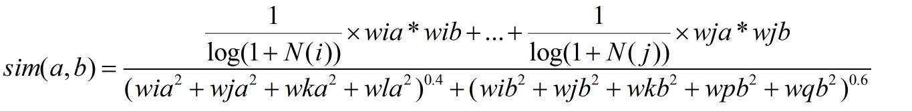

# Practice:推荐系统_1(简易)

我的一次初级的推荐系统实践 （2018.5）

某推荐好物种草购物APP,用户量约一百万，实际活跃用户近20万。二八定律。商业模式：APP旗下有众多时尚博主买手，每天定期发布测评推荐文章。一篇文章通常对应一件商品，也有少量一篇文章对应N件商品，如上衣裤子套装。

因此要推荐的最小单元其实是文章。每件文章下必带商品。文章的总数在十万级,所以使用推荐系统进行“千人千面”的推荐，效果是有些吃力哦。经过几个月的部署实践，个性化推荐Banner页上线没多久，下一版本成功地被砍掉了。

下面是CEO采访原话

> “XXXX(APP)会朝着类今日头条的兴趣推荐方向发展吗？”
>
> “最具特点的就是选品和内容，他们的调性、风格、眼光是吸引用户的核心，这种感知是机器给不了的；**另一方面，我们曾经尝试过基于用户行为的算法，但需要很大的样本和内容，短期之内很难做到。**”
>
> 在CEO看来，今日头条之所以可以基于兴趣推荐吸引大量用户，是因为信息供给（文字、视频等形式）本身容易很快形成海量的规模。在XXXX(APP)这样的供给端增长速度下，很难快速实现海量。

扯远了 下面谈具体细节

### 召回阶段

和之前的推荐系统笔记一样，使用的是多路召回，筛选候选集，分别有以下几种：

1、基于用户兴趣标签的召回。用户的兴趣标签是从哪里的？其实很简单，在用户注册时就会有一个标签选择页，用户可选择感兴趣的标签，如：清新范，品酒师等等。如果用户不选择标签，那么就没有该路下的召回文章。这些标签又是怎么和文章挂上勾的，其实也很简单，运营小姐姐们搭配的。（这大概就是数据体量还不大的好处，就算没有自动化推荐系统，几个运营小姐姐，几包零食和下午茶就能给你出一套还阔以的推荐。像淘宝、今日头条就不行，数据量太大，淘宝光兴趣标签就有上万种，其中就有NLP的功劳）。每个兴趣标签对应相应的若干篇文章，用户亦可选择多个兴趣标签。这一路召回拿到的文章总数 = M(兴趣标签数) * N(每个标签下对应的文章)

2、基于热门统计的召回。统计全网APP下卖的最火最好的商品Top100。这一路很简单，但很实用，尤其是其他路召回都失效时，比如新用户兴趣标签没填，也没有浏览log，无法计算协同过滤，就可以把热门统计的召回作为冷启动，虽保守但有效。用户在这一路的一定是有的，且每个人都是一样的

3、基于商品（文章）的协同过滤。为什么不使用基于用户的协同过滤？特别简单，用户百万级，设备有限，内存暴了。无论是商品还是用户的协同过滤，最重要的是 某用户对某商品的"打分"。而购物类APP不像豆瓣一样有几星几星打个分，用户不喜欢这个商品就退出了，并不会告诉你。所以需要自己造出一批打分，即用户对商品的喜爱度。然后就花了些时间，定义设计喜爱度。最后一番数据探索，敲定喜爱度由点击、浏览、喜欢、分享等行为次数组成，并给予相应权重。权重由熵权法+人工拍脑袋决定，熵权法的权重有合理的部分，也有不合理的，最后说白了，熵权法作为参考，人工决定了一套(自认为合理的)权重，比如:点击次数:有效浏览次数:喜欢次数:分享次数 =0.05 :0.3:0.15:0.5。有喜爱度，一个矩阵就出来了，按照协同过滤公式，计算相似度，代码一步步实现(非常简单，也不用使用三方库)。这里对协同过滤基本版进行适当改进，降低热门商品的权重和博爱(什么东西都喜欢)的人的权重，数学公式上

a,b指两个文章的相似度，基础版分母是0.5，0.5 这里更改为0.4，0.6，对热门文章的惩罚。哪个文章下总的喜爱度更高 谁就配0.6.若两个文章总的喜爱度相等，则0.5,0.5。分子也增加了相应的权重，基本版分子是1:1...:1,改进版是增加1/log(1+N(i))的权重。N(i)指该用户喜爱度超阈值的文章的篇数。

优化结果：一定程度上解决了过多推荐热门文章的问题(因为在第二路召回就已经有热门文章)，推荐结果覆盖率更广，惊喜度更高，有些冷门文章推荐。

最后根据协同过滤计算出的相似度，选出Top100

4.基于主题模型LDA的召回

这路召回当时做的很仓促，比较简陋。大致思路是：因为是文本，所以就想到 了文本主题模型LDA。具体什么原理也忘记了，但是会调包啊 (太不厚道，现在真的是黑匣子一个个封装，管他是啥，参数一顿调，能跑就行)。

### 排序阶段

综上，4路召回，下一步排序阶段

从这里开始路就走歪了

正常的流程，4路召回大大压缩了候选集，过滤掉业务规则，比如已经看过的、买过的。根据3种特征：用户，物品，环境)再加一个label(是否点击)，开始CTR预估。

然后事实上并没有做(种种原因 本身给到的Banner资源位并不多，要推荐的数量大致在几十个左右，不是今日头条、抖音那种地无限刷刷。因为本身文章数量就不多)

所以到这一步，开始自由发挥(CTR预估性价比很不高，大炮打苍蝇)。

另加运营要求必须有3个来自的热门推荐。

那究竟怎么做呢？

每一路都有相应召回。根据召回的排名Rank*相应的权重分(还是拍脑袋)进行统一倒排 ，再去重(4路召回可能有重复)

主题推荐Rank*0.1， 兴趣标签 Rank * 0.2 ，  协同过滤Rank * 0.3 , 热门推荐Top3Rank *0.0001

这样子就排好了 开始推荐吧

### 总结

总的来说，做的这套推荐系统非常的初级。基本的框架模子是有了

外因：本身内容不多，有种巧妇难为无米之炊的无力感

内因：主题模型LDA掌握不扎实，排序阶段也没尝试

以后有机会还是想多实践实践推荐

 